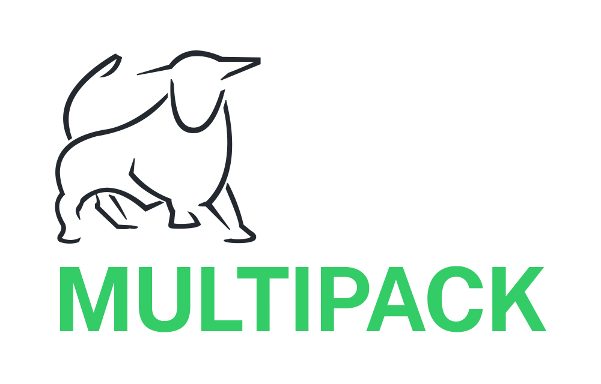

# The Multipack Brand

## Logo

Since 2010, the Multipack’s logo has featured a simplified rendition of Laurence Broderick’s *The Guardian,* the [bronze bull sculpture that sits outside the Bullring Centre in Birmingham](https://en.wikipedia.org/wiki/Bull_Ring,_Birmingham#Artwork).

A few notes on usage:

* When used in the logo, the word ‘Multipack’ is uppercased
* The bull icon can be used on its own, or with the word mark. When used together, both are aligned to the left.

## Colour palette

Brand colours:

| Name | HEX | HSL |
| ---- | --- | --- |
| Green | `#33cc66` | `hsl(140, 60%, 50%)` |
| Teal | `#006666` | `hsl(180, 100%, 20%)` |
| Blue | `#0066cc` | `hsl(210, 100%, 40%)` |

Neutral palette:

| Name | HEX | HSL |
| ---- | --- | --- |
| Darkest | `#23292f` | `hsl(210, 15%, 16%)` |
| Dark | `#45525e` | `hsl(210, 15%, 32%)` |
| Mid | `#687a8d` | `hsl(210, 15%, 48%)` |
| Light | `#c4ccd4` | `hsl(210, 15%, 80%)` |
| Lightest | `#f3f5f6` | `hsl(210, 15%, 96%)` |

## Typeface

The Multipack brand and website use *Public Sans*. This [open source typeface](https://github.com/uswds/public-sans) is available under the SIL Open Font License and can be downloaded from the [Public Sans website](https://public-sans.digital.gov) or [Google Fonts](https://fonts.google.com/specimen/Public+Sans).
